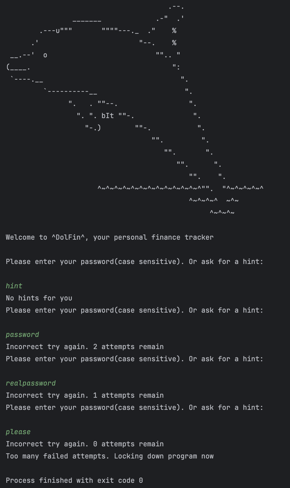
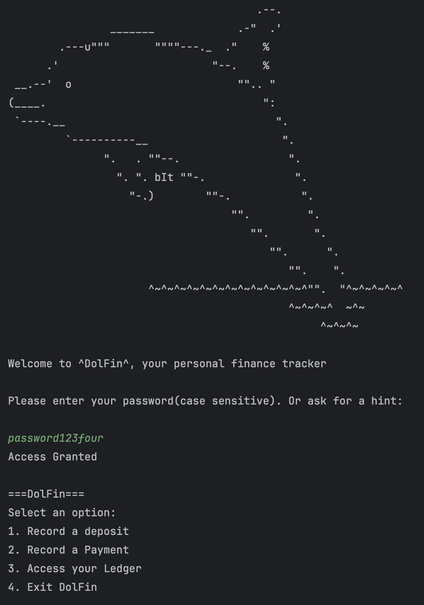

# DolFin 🐬
## The only finance app you'll ever need

### What is DolFin?
Taking inspiration from the smartest swimmer in the sea, DolFin uses high intelligence to track, record, and analyze your life's transactions.

DolFin will make sure that all your payments and deposits are tracked with accuracy and always there when you need to go back to take a look at them.

### What can DolFin do? 
DolFin can record your new deposits and payments, show all entries or filter by deposits or payments, and also view specialized reports. 
These specialized reports can highlight transactions by:
- **Month-to-Date** 
- **Previous Month**
- **YTD**
- **Previous Year**

When viewing deposits or payments, DolFin will also keep track of how many deposits/payments are found as well as calculating the grand total.

### What makes DolFin special? 
In the vast market of financial apps, what you can find with DolFin but not our competitors are a peace of mind, ease and most importantly security. 

We use a highly complex authentication process where the user will be prompted to enter a password. Without the password, 
there is no getting around to the data being safely stored in our **private** servers

Don't believe us? Take a look behind the scenes, at one of highly secure algorithms for gaining access to the application's info.
``` java 
System.out.println("\nWelcome to ^DolFin^, your personal finance tracker\n");
        while (maxAttempts > passwordAttempts && !accessGranted) {
            System.out.println("Please enter your password(case sensitive). Or ask for a hint: \n");
            String userPasswordEntry = scanner.nextLine();
            if (userPasswordEntry.toLowerCase().contains("hint")) {
                System.out.println(passwordHint);
            } else if (!userPasswordEntry.equals(realPassword)) {
                passwordAttempts++;
                System.out.printf("Incorrect try again. %d attempts remain\n", maxAttempts - passwordAttempts);
            } else {
                System.out.println("Access Granted");
                accessGranted = true;
            }
        }
        if (!accessGranted) {
            System.out.println("Too many failed attempts. Locking down program now");
        }
        return accessGranted;
```
### Show me the proof.
Fine, I understand that in today's day and age it's expected to be a little skeptical. Just to be nice, I put a picture 
of what it'll look like when you try to get in without knowing the password. 

### What if I have the real password?
Congrats, with the right password, you'll be able to make your way in and use the best finance app you've ever seen.
Just so you can compare, here's what it'll look like once you enter the *right* password
